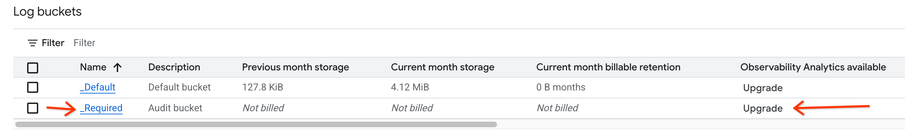
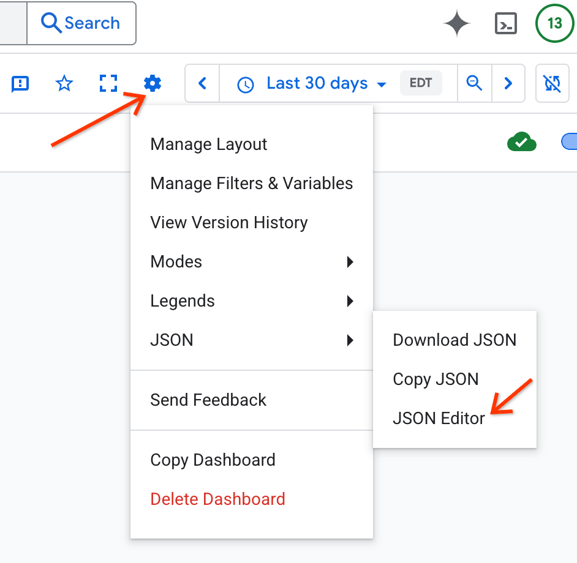
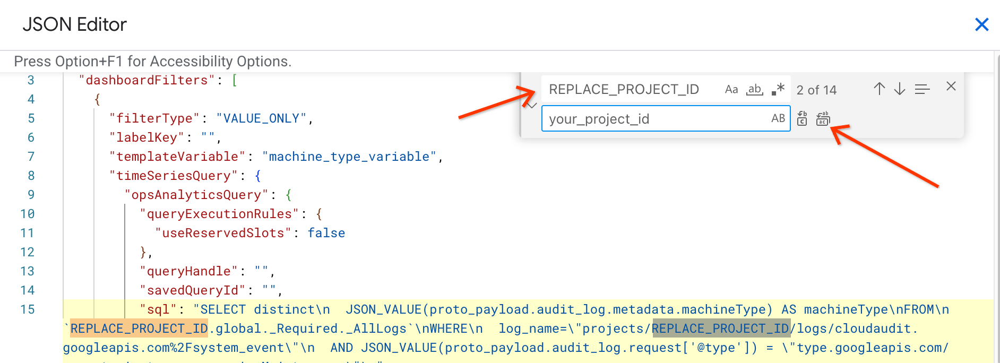

### Dashboards for Agent for SAP

|Agent for SAP - HANA Overview|
|:------------------|
|Filename: [agent-for-sap-hana-overview.json](agent-for-sap-hana-overview.json)|
|This dashboard is based on [Google Cloud Agent for SAP](https://cloud.google.com/solutions/sap/docs/agent-for-sap/latest/all-guides) and has status overview charts displaying `HANA Availability`, `HANA High Availability`, `HANA HA Replication`, `HANA Service Status`, `HA Cluster - Node State`,`HA Cluster - Resource State` for SAP HANA Instances. The charts in this dashboard indicate the status of the entities with a value of `1` indicating healthy status.|

|Agent for SAP - HANA Raw Metrics|
|:------------------|
|Filename: [agent-for-sap-hana-raw-metrics.json](agent-for-sap-hana-raw-metrics.json)|
|This dashboard is based on Google's [Google Cloud Agent for SAP](https://cloud.google.com/solutions/sap/docs/agent-for-sap/latest/all-guides) and has charts displaying raw metric values for `HANA Availability`, `HANA High Availability`, `HANA HA Replication`, `HANA Service Status`, `HA Cluster - Node State`,`HA Cluster - Resource State` for SAP Instances. The charts in this dashboard indicate the raw metrics. The description of different possible values can be found in MQL for respective charts.|

|Agent for SAP - HANA Availability Monitoring|
|:------------------|
|Filename: [agent-for-sap-hana-availability-monitoring.json](agent-for-sap-hana-availability-monitoring.json)|
|This dashboard is based on [Google Cloud Agent for SAP](https://cloud.google.com/solutions/sap/docs/agent-for-sap/latest/all-guides) and is an interactive playbook for determining HANA Availability during a given timeframe.|

|Agent for SAP - Backint Metrics|
|:------------------|
|Filename: [agent-for-sap-backint-metrics.json](agent-for-sap-backint-metrics.json)|
|This dashboard is based on [Google Cloud Agent for SAP](https://cloud.google.com/solutions/sap/docs/agent-for-sap/latest/all-guides) and has status and throughput charts displaying `Backup Status`, `Backup Throughput`, `Restore Status`, and `Restore Throughput` for Backint based backups and recoveries. The status charts in this dashboard indicate the status of backups and restores with a value of `1` indicating a successful transfer. The throughput charts in this dashboard indicate the transfer rate of backups and restores in Mbps. This dashboard also contains Backint logs and can be filtered by severity level.

|Compute Engine - Instance Maintenance Events|
|:------------------|
|Filename: [maintenance-system-events.json](maintenance-system-events.json)|
|This dashboard has charts displaying Log Analytics queries for Compute Engine Instance maintenance events, filterable by Machine Type.   See the setup instructions below.|

 

### Compute Engine - Instance Maintenance Events Setup

#### Log Storage Upgrade

In order to use the Compute Engine - Instance Maintenance Events dashboard the
`_Required` Logs must have it's Log Storage upgraded.

**NOTE**: There is no additional cost for upgraded Log Storage

1. Go to the Google Cloud
[Log Storage](http://console.cloud.google.com/logs/storage) page in the project
where you want to create the dashboard

2. Click the `Upgrade` button for the row with the `_Required` logs

      

3. Click the `Upgrade` button in the dialog that is opened.

**NOTE**: Only maintenance events that are logged after the Log Storage upgrade
will be seen in the dashboard

#### JSON String Replacement

The maintenance-system-event.json needs to have `REPLACE_PROJECT_ID` replaced
before the dashboard can be used.

1. Go to the
[Cloud Monitoring Dashboards](http://console.cloud.google.com/monitoring/dashboards)
page

2. Click the `Create Custom Dashboard` button
3. Click the settings icon and select the `JSON Editor`:

      

4. Copy and paste the JSON from the
[maintenance-system-events.json](maintenance-system-events.json) file into the
JSON Editor
5. Use `Cmd+F` to open the Find tool
6. Expand the Find tool to expose the Replace functionality:

      

7. Enter `REPLACE_PROJECT_ID` in the Find text and your project id in the
Replace text
8. Click the replace all icon in the Find tool
9. Click the `Apply Changes` in the JSON Editor
10. Your dashboard is ready for use, you can close the JSON Editor
